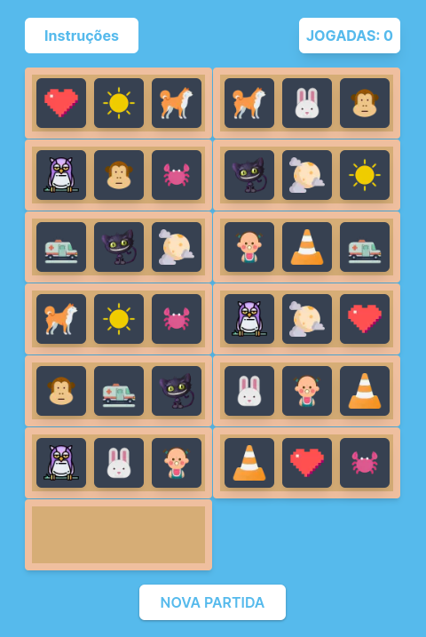
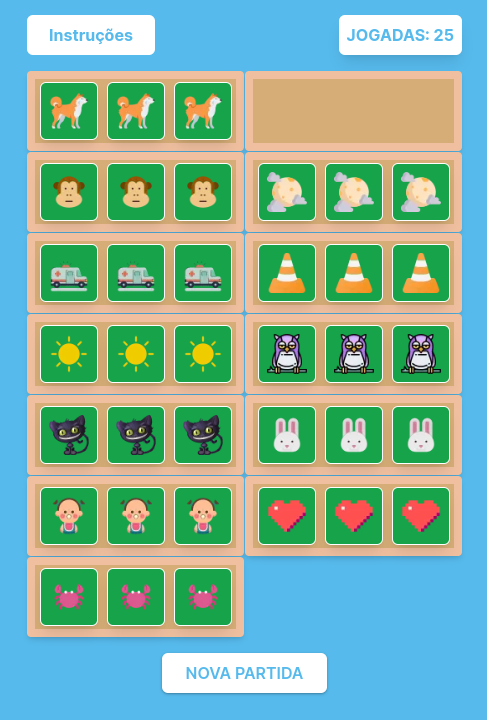

# Jogo-Organizar-Itens-NextJS

Jogo Organizar Itens NextJS, utilizando [Next.js](https://nextjs.org/) versão 14.2.3

## Getting Started

Primeiro, execute o servidor de desenvolvimento:

```bash
npm run dev
# ou
yarn dev
# ou
pnpm dev
# ou
bun dev
```

Abra [http://localhost:3000](http://localhost:3000) com seu navegador para ver o resultado.

##
    Este jogo interativo, desenvolvido com Next.js, desafia suas habilidades de lógica e percepção ao mover cards para reorganizá-los em uma ordem específica. A seguir, você encontrará as instruções detalhadas sobre como jogar.


# Como Jogar:

Bem-vindo ao nosso jogo de reorganizar itens! Este jogo interativo, desenvolvido com Next.js, desafia suas habilidades de lógica e percepção ao mover cards para reorganizá-los em uma ordem específica.

## Objetivo do Jogo

O objetivo do jogo é reorganizar todos os cards na ordem correta, movendo-os para os espaços vagos disponíveis. Cada card pode ser movido apenas para um espaço adjacente vazio.

## Instruções de Uso

### Início do Jogo
Ao iniciar o jogo, você verá uma série de cards dispostos em uma grade, com 3 espaços vagos

### Mover um Card
Para mover um card, siga estes passos:

1. **Selecione o Card:** Clique no card que você deseja mover. O card selecionado ficará destacado para indicar que está pronto para ser movido.
2. **Selecione o Espaço Vago:** Clique no espaço vago onde você deseja mover o card. O card selecionado será movido para o espaço vago escolhido.

## Exemplo de Uso

1. Você vê uma grade de cards embaralhados com um espaço vago.
2. Clique no card que deseja mover (ele será destacado).
3. Clique no espaço vago para mover o card para esse espaço.
4. Continue movendo os cards até que todos estejam na ordem correta.
5. Clique em "Reiniciar" para começar uma nova partida.

<p>&nbsp</p>





